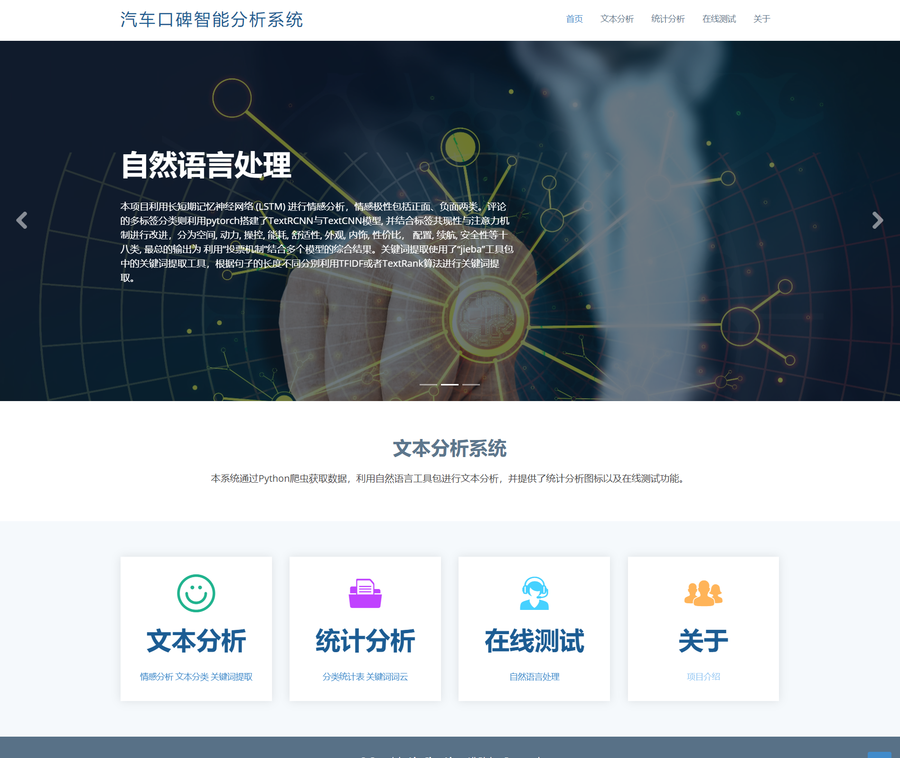
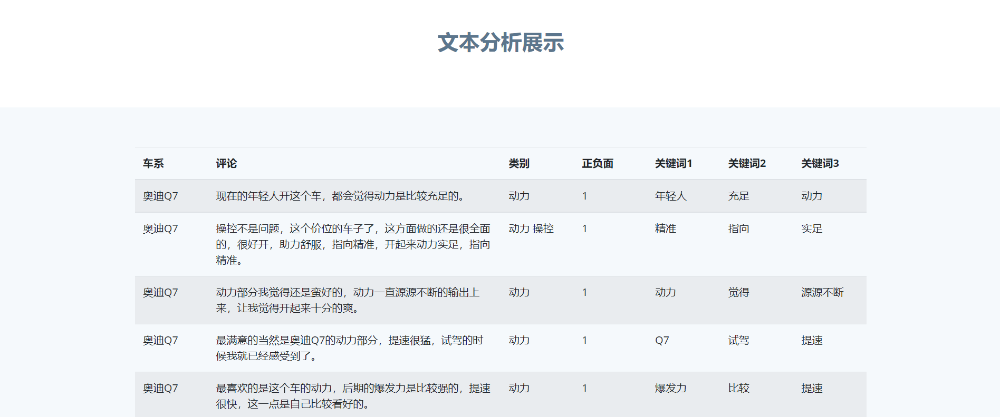
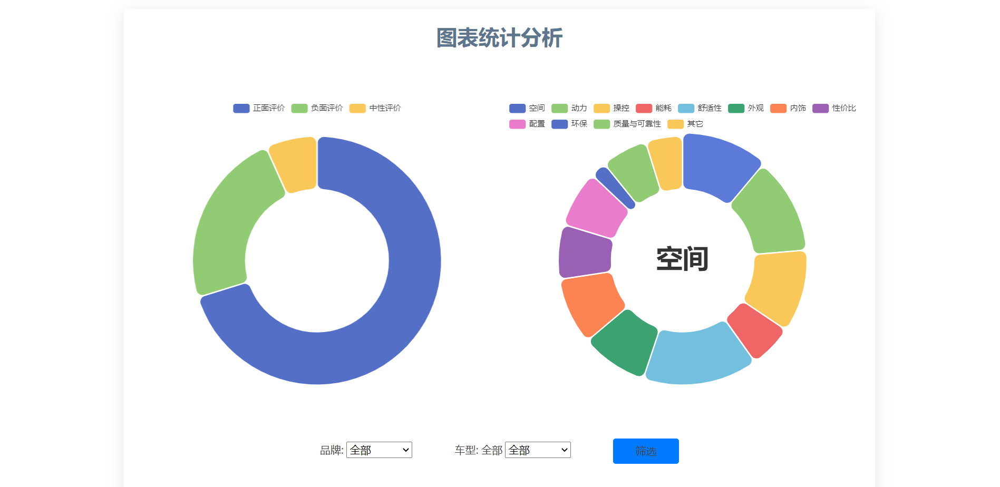
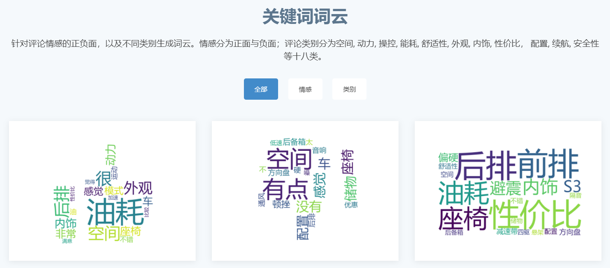
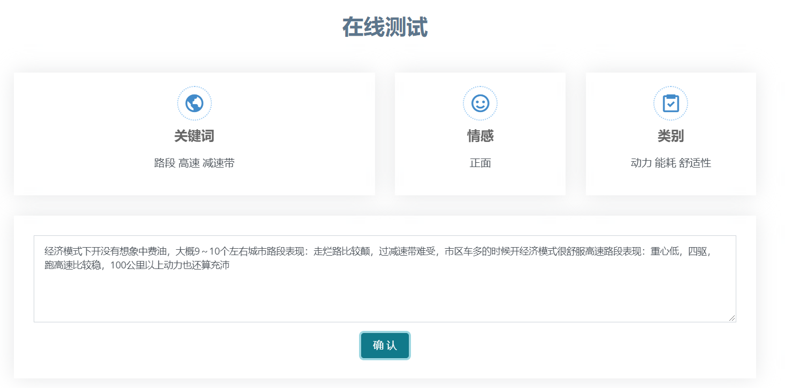

# Text Analysis System

This is my course project of ''Joint Project of Intelligent Application''. The system is developed to a) provide users with direct, visual, and proccessed (sentiment analysis and multi-label classification) comment data of AutoHome Platform; b) show users the basic statistical information of data (e.g. pie charts and key word could); c) provide users with direct access to testing sentiment analysis and multi-label classification algorithms.

※: The comments data is crawling from the ''Autohome'' platform and then annotated by me and my groupmates. There may be follow-on work on this data set so it is not released as public. I only provide a sample data located in `./data/`.

# Technologies

* web framework: Django
* Front-end web development: Bootstrap
* Database: Mysql
* data crawling: selenium
* Machine Learning framework: 
  * multi-label classification(developed by me): Pytorch
    * NN models: TextCNN, TextRCNN (more details is shown in [Multi-label Text Classification](https://github.com/Luke-Liu-01/Multi-label-Text-Classification))
    * other moudles: Initialization-based Methods, self-attention
  * sentiment analysis(developed by groupmate): Tensorflow
    * NN models: LSTM

# Web page screenshots

  * home page
  

    
  * comments data and statistical information
    * comments data
  

    * label distribution
  

    * key word could
  

  * algorithm testing
  

